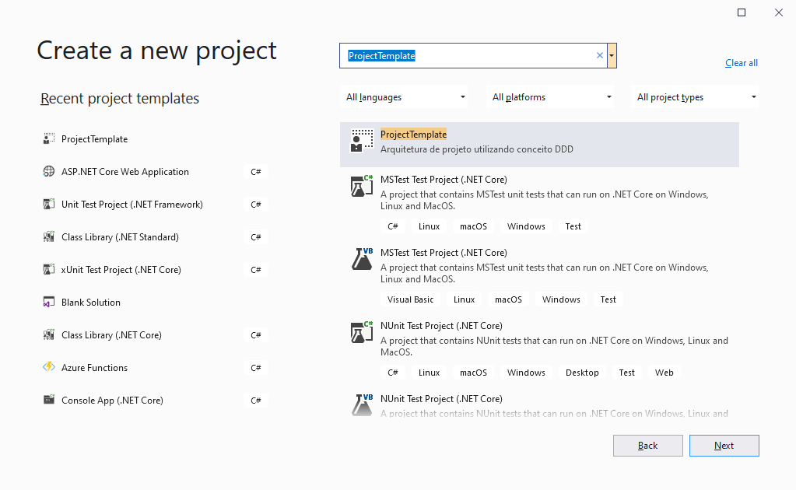

# Template de Projeto DDD (Domain Driven Design)

Implementado um template para utilização no Visual Studio 2019, utilizando "_DDD_" e alguns outros Designer Patterns.

# Designer Patterns e Conceitos (Links)
1. Inversão de Controle (IoC) - [O padrão de inversão de controle](https://imasters.com.br/dotnet/o-padrao-de-inversao-de-controle-ioc)

2. Injeção de Dependência (DI) - [Design Patterns - Injeção de Dependência com C#](https://www.devmedia.com.br/design-patterns-injecao-de-dependencia-com-csharp/23671)

3. Repository Pattern - [Entendendo o Repository Pattern](https://medium.com/@renicius.pagotto/entendendo-o-repository-pattern-fcdd0c36b63b)

4. Notification Pattern - [Não Lance Exceptions em seu Domínio... Use Notifications!](https://medium.com/tableless/n%C3%A3o-lance-exceptions-em-seu-dom%C3%ADnio-use-notifications-70b31f7148d3)

5. Value Objects - [Value Objects: Uma Técnica Para Código Auto-Documentado E Menos Erros](https://carlosschults.net/pt/value-objects-ferramenta/)

# Como utilizo esse template?

Copie o arquivo _Template.zip_ que esta dentro da pasta _Template_ para a pasta "C:/Users/[USER]/Documents\Visual Studio 2019\Templates\ProjectTemplates\Visual C#"... Simples assim...

Após colar o .zip na pasta é só abrir o Visual Studio 2019 e pedir para criar um novo projeto. Segue imagem abaixo

# Entendendo...

# Pesquisa e estudo realizado em diversos locais, segue um link para guia - [Explicação mais detalhada sobre o DDD e seus pilares](https://medium.com/beelabacademy/domain-driven-design-vs-arquitetura-em-camadas-d01455698ec5)

# “Toda arquitetura é design, mas nem todo design é arquitetura” — Grady Booch

### **1.Application**

Como todo projeto, precisamos de uma porta de entrada das nossas requisições e para esse template, estou utilizando o ASP.NET API, mas poderia também estar utilizando ASP.NET MVC (alteração que implica na mudança da forma que desenvolvemos a injeção de Dependência).

### **2.Domain**

Para este template, o projeto de Domain é responsável por gerenciar toda a regra de negócio da aplicação. A camada de domínio é a base para todo o conceito DDD (Domain Driven Design).

Também no projeto de Domain foi definido as interfaces dos _Repositórios_, assim qualquer regra para acessar a base de dados será implementada neste projeto.

### **3.InfraEstructure**

O projeto de Infraestrutura para este template tem como responsabilidade gerenciar o acesso ao banco de dados e também a Injeção de Dependência. Para isso foi segregado em outros dois projetos _CrossCutting_ e _Data_.

- **CrossCutting**

    Nesta parte do template foi implementado a Injeção de Dependência dos repositórios, Services e também do Contexto que foi utilizado no template (linhas para utilização da Banco de Dados SQL Server como contexto está comentado).

    Existem alguns exemplos que a camada de CrossCutting, é responsável por incluir toda regra de segurança da aplicação, Cache e entre outros. Para este template foi incluido o projeto Shared, assim deixando o projeto de Application com menos responsabilidades possíveis.

- **Data**

    Tem como responsabilidade a implementação do Contexto utilizado, por exemplo, se voce utiliza Entity Framework, é nesta camada onde seria implementado o _Unit of Work_, onde seria implementado os DbSet e toda configuração do EF.

    As interfaces dos repositórios que foram declaradas no projeto Domain, tem a sua implementação realizada neste projeto.

### **3.Services**

A responsabilidade da camada de Services é 'traduzir' as requisições da API para os Repositórios, por exemplo, mapear um _DTO (Data Transfer Object)_ para uma entidade e assim executar um insert pelo Repositório. Este template está separado em dois projetos, _Interfaces_ e _Services_ para uma melhor organização.

- **Interface**

    No template, este projeto é utilizado para a implementação das classes de DTO, responsáveis por receber as informações enviadas pela camada de _Application_, e também por definir as interfaces que serão utilizadas no projeto de Service. Utilizado o componente AutoMapper para o mapeamento entre uma DTO e uma Entidade.

- **Services**

    Neste projeto, contém as implementações das interfaces dos Services e tem como responsabilidade realizar as validações necessárias para que a requisição que chegou via API por exemplo, seja trafegada até os devidos repositórios.

### **4.Shared**

O projeto _Shared_ implementa toda regra que precisa ser compartilhada com as outras camadas do projeto, por exemplo, a classe abstrata do _Value Objects_.

### **5.Tests**
Este projeto tem como responsabilidade criar e executar todos os tipos de testes.
